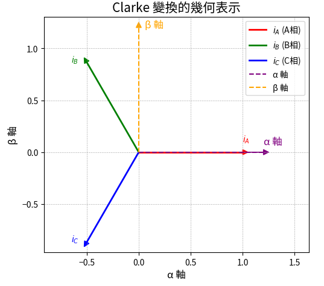

Clarke 變換
==============

**1. 為何需要 Clarke 變換？**

在三相平衡交流系統中，通常會有三個相電壓/電流（ :math:`i_A, i_B, i_C` ），它們是彼此相差 120° 的正弦波。然而，這三個變數並非完全獨立，它們本身也受 **克希荷夫電流定律 (KCL)** 限制。
從馬達的三相看，電流一定是任意一相或兩相流入，配合另外兩相或一相流出，所以一定會滿足 **KCL**。

三相電機控制中，三相電流在物理上代表一個旋轉向量( :math:`i_A,i_B,i_C` )，Clarke 變換的目標是把三相電流轉換成二維正交坐標系 ( :math:`i_\alpha,i_\beta` )，這樣可以用二維空間來描述三相電流的變化，可以更容易處理旋轉坐標的問題。

基於 **KCL**，三個變數中只有兩個是獨立的。**Clarke 變換** 的目的就是找到一個 **變換矩陣 T**，將三相電壓/電流 ( :math:`i_A,i_B,i_C` ) 轉換到一個二維的正交 **α-β 靜止坐標系** ( :math:`i_\alpha,i_\beta` ) 中：

.. math::
   \left[
   \begin{matrix}
    i_\alpha \\
    i_\beta
   \end{matrix}
   \right]
   = T *
   \left[
   \begin{matrix}
   i_A \\
   i_B \\
   i_C
   \end{matrix}
   \right]

這樣做的優點是，我們可以使用兩個獨立的變數 :math:`\left(\textbf{i}_\mathbf{\alpha}, \textbf{i}_\mathbf{\beta}\right)` 在二維平面上 **完整地描述** 原始三相系統的電壓/電流資訊，簡化後續的分析和控制。

**2. 幾何直覺**

為了更好地理解 Clarke 變換，我們可以從幾何的角度來看：

-   **原始三相坐標** ( :math:`\mathbf{i_A, i_B, i_C}` )：每一相電流可以想像成對應到一個基底向量，這些向量之間相隔 **120°**。

.. math::
   0 &= i_A + i_B + i_C　\\
   \omega &= 2{\pi}f \\
   i_A &= sin({\omega}t + \theta) \\
   i_B &= sin({\omega}t + \theta + \frac{2\pi}{\sqrt{3}}) \\
   i_C &= sin({\omega}t + \theta - \frac{2\pi}{\sqrt{3}})

-   **目標 α-β 二維坐標系**：我們希望建立一個 **正交基底** 來表示新的二維系統，方便分析：

    -   **α 軸**：方向與 A 相（ :math:`i_A` ）相同。
    -   **β 軸**：方向與 α 軸正交。

Clarke 變換的幾何意義就是將原始三相系統中的每個相電流 **投影** 到這個新的正交 :math:`\mathbf{\alpha}` 和 :math:`\mathbf{\beta}` 軸上，
得到它們在二維平面上的分量 :math:`i_\mathbf{\alpha}` 和 :math:`i_\mathbf{\beta}`。

**3. 基底向量推導**

根據上述幾何直覺，我們可以推導出 Clarke 變換的基底向量和轉換矩陣：

-   :math:`\textbf{i}_A` **的基底表示**: :math:`\left(\begin{matrix} 1,& 0\end{matrix}\right)`

    將 :math:`i_A 對齊 \alpha軸`, 可以得到下面投影

    .. math::
      \alpha 軸&: cos(0^\circ) &= 1 \\
      \beta 軸&: sin(0^\circ) &= 0

-   :math:`\textbf{i}_B` **的基底表示**: :math:`\left(\begin{matrix} \frac{-1}{2},& \frac{\sqrt{3}}{2}\end{matrix}\right)`

    而 :math:`i_B` 的投影則對應到

    .. math::
      \alpha 軸&: cos(120^\circ) &= \frac{-1}{2} \\
      \beta 軸&: sin(120^\circ) &= \frac{2}{\sqrt{3}}

-   :math:`\textbf{i}_C` **的基底表示**: :math:`\left(\begin{matrix} \frac{-1}{2},& \frac{-\sqrt{3}}{2}\end{matrix}\right)`

    而 :math:`i_C` 的投影則對應到

    .. math::
      \alpha 軸&: cos(240^\circ) &= \frac{-1}{2} \\
      \beta 軸&: sin(240^\circ) &= \frac{-2}{\sqrt{3}}

基於這些基底向量，我們可以 **構造出 Clarke 變換的矩陣 T**：

.. math::

   T =
   \left[
   \begin{matrix}
   1 & -\frac{1}{2} & -\frac{1}{2} \\
   0 & \frac{\sqrt{3}}{2} & -\frac{\sqrt{3}}{2}
   \end{matrix}
   \right]

**4. 矩陣驗證與標準公式**

將三相電流 :math:`[i_A, i_B, i_C]^T` 帶入上述轉換矩陣，我們可以得到 :math:`\mathbf{\alpha}` 和 :math:`\mathbf{\beta}` 分量：

.. math::
   i_\alpha &= i_A - \frac{1}{2}i_B - \frac{1}{2}i_C \\
            &= i_A - \frac{1}{2}(i_B + i_C) \\
   i_\beta &= \frac{\sqrt{3}}{2}i_B - \frac{\sqrt{3}}{2}i_C \\
           &= \frac{\sqrt{3}}{2}(i_B - i_C)

上面的變換只是做了相關相位角度的變換，我們期望轉換完後的　:math:`(i_A, i_B, i_C)` 與 :math:`(i_\alpha, i_\beta)` 的功率大小(RMS)也不變。

.. math::
      {i_A}^2 + {i_B}^2 + {i_C}^2 = {i_{\alpha}}^2 + {i_{\beta}}^2

經過均方根計算比較後，我們得到一個需要相乘縮放係數　:math:`k = \frac{2}{3}` 才能讓信號維持相同振幅(RMS相等)。而基於 **KCL**　原則，則可以進一步簡化為下列形式

.. math::
      i_A &= -(i_B + i_C) \\
      i_\alpha &= k(i_A - \frac{1}{2}(i_B + i_C)) \\
      &= \frac{2}{3}(i_A + \frac{1}{2}i_A) \\
      &= i_A \\
      \\
      i_\beta &= k\frac{\sqrt{3}}{2}(i_B - i_C) \\
      &= \frac{2}{3}\frac{\sqrt{3}}{2}(i_B - i_C) \\
      &=\frac{\sqrt{3}}{3}(i_B - i_C)\quad\dots\text{將分子, 分母同乘}\sqrt{3} 有理化　\\
      &=\frac{1}{\sqrt{3}}(i_B - i_C)

倘若系統不平衡的話，需要另外一個零序分量，我們現在只考慮平衡狀態

**5. Clarke 變換的程式碼實現**

在程式碼中，Clarke 變換通常會接收三相電流 :math:`(i_A, i_B, i_C)` 或電壓作為輸入，並輸出兩相的 :math:`{\alpha}-{\beta}` 分量 :math:`(i_{\alpha}, i_{\beta})` 。以下是ODrive 使用的　Clarke 變換的實現程式碼：

.. code-block:: c++

   Motor::Error AlphaBetaFrameController::on_measurement(
               std::optional<float> vbus_voltage,
               std::optional<std::array<float, 3>> currents,
               uint32_t input_timestamp) {

      std::optional<float2D> Ialpha_beta;

      if (currents.has_value()) {
         // Clarke transform
         Ialpha_beta = {
               (*currents)[0],
               one_by_sqrt3 * ((*currents)[1] - (*currents)[2])
         };
      }

      return on_measurement(vbus_voltage, Ialpha_beta, input_timestamp);
   }

而 STM32 的MCSDK 則使用下面程式碼實做，一樣透過**KCL** 把 :math:`(i_B - i_C)` 轉換為 :math:`(2i_B - i_A)` :

.. code-block:: c++

   /**
   * @brief  This function transforms stator values a and b (which are
   *         directed along axes each displaced by 120 degrees) into values
   *         alpha and beta in a stationary qd reference frame.
   *                               alpha = a
   *                       beta = -(2*b+a)/sqrt(3)
   * @param  Input: stator values a and b in ab_t format.
   * @retval Stator values alpha and beta in alphabeta_t format.
   */
   __weak alphabeta_t MCM_Clarke(ab_t Input)
   {
      alphabeta_t Output;

      int32_t a_divSQRT3_tmp;
      int32_t b_divSQRT3_tmp;
      int32_t wbeta_tmp;
      int16_t hbeta_tmp;

      /* qIalpha = qIas*/
      Output.alpha = Input.a;

      a_divSQRT3_tmp = divSQRT_3 * ((int32_t)Input.a);

      b_divSQRT3_tmp = divSQRT_3 * ((int32_t)Input.b);

      /* qIbeta = -(2*qIbs+qIas)/sqrt(3) */
      #ifndef FULL_MISRA_C_COMPLIANCY_MC_MATH
      /* WARNING: the below instruction is not MISRA compliant, user should verify
         that Cortex-M3 assembly instruction ASR (arithmetic shift right) is used by
         the compiler to perform the shift (instead of LSR logical shift right) */
      //cstat !MISRAC2012-Rule-1.3_n !ATH-shift-neg !MISRAC2012-Rule-10.1_R6
      wbeta_tmp = (-(a_divSQRT3_tmp) - (b_divSQRT3_tmp) - (b_divSQRT3_tmp)) >> 15;
      #else
      wbeta_tmp = (-(a_divSQRT3_tmp) - (b_divSQRT3_tmp) - (b_divSQRT3_tmp)) / 32768;
      #endif

      /* Check saturation of Ibeta */
      if (wbeta_tmp > INT16_MAX)
      {
         hbeta_tmp = INT16_MAX;
      }
      else if (wbeta_tmp < (-32768))
      {
         hbeta_tmp =  ((int16_t)-32768);
      }
      else
      {
         hbeta_tmp = ((int16_t)wbeta_tmp);
      }

      Output.beta = hbeta_tmp;

      if (((int16_t )-32768) == Output.beta)
      {
         Output.beta = -32767;
      }
      else
      {
         /* Nothing to do */
      }

      return (Output);
   }

在 ARM CMSIS-DSP Pack 中則定義為下面，一樣為 :math:`\frac{1}{\sqrt{3}}(2i_B + i_A)`

.. code-block:: c++

   /**
   *
   * @brief  Floating-point Clarke transform
   * @param[in]  Ia       input three-phase coordinate <code>a</code>
   * @param[in]  Ib       input three-phase coordinate <code>b</code>
   * @param[out] pIalpha  points to output two-phase orthogonal vector axis alpha
   * @param[out] pIbeta   points to output two-phase orthogonal vector axis beta
   * @return        none
   */
   __STATIC_FORCEINLINE void arm_clarke_f32(
   float32_t Ia,
   float32_t Ib,
   float32_t * pIalpha,
   float32_t * pIbeta)
   {
     /* Calculate pIalpha using the equation, pIalpha = Ia */
     *pIalpha = Ia;

     /* Calculate pIbeta using the equation, pIbeta = (1/sqrt(3)) * Ia + (2/sqrt(3)) * Ib */
     *pIbeta = ((float32_t) 0.57735026919 * Ia + (float32_t) 1.15470053838 * Ib);
   }

在程式碼中，**三相電流被轉換為兩相靜止坐標系下的電流分量** :math:`i_\alpha` **和** :math:`i_\beta` 。

上面的程式碼中的 ``one_by_sqrt3``　與 ``divSQRT_3`` 都是代表 :math:`\mathbf{\frac{1}{\sqrt{3}}}` ，
並且所有程式碼內都是預先計算好的常數。

總體來說，**Clarke 變換** 是一種重要的坐標轉換手段，它將三相交流系統的變數轉換到一個更易於分析和控制的二維靜止坐標系中，是 **場導向控制 (FOC)** 等現代電機控制技術的基礎。
